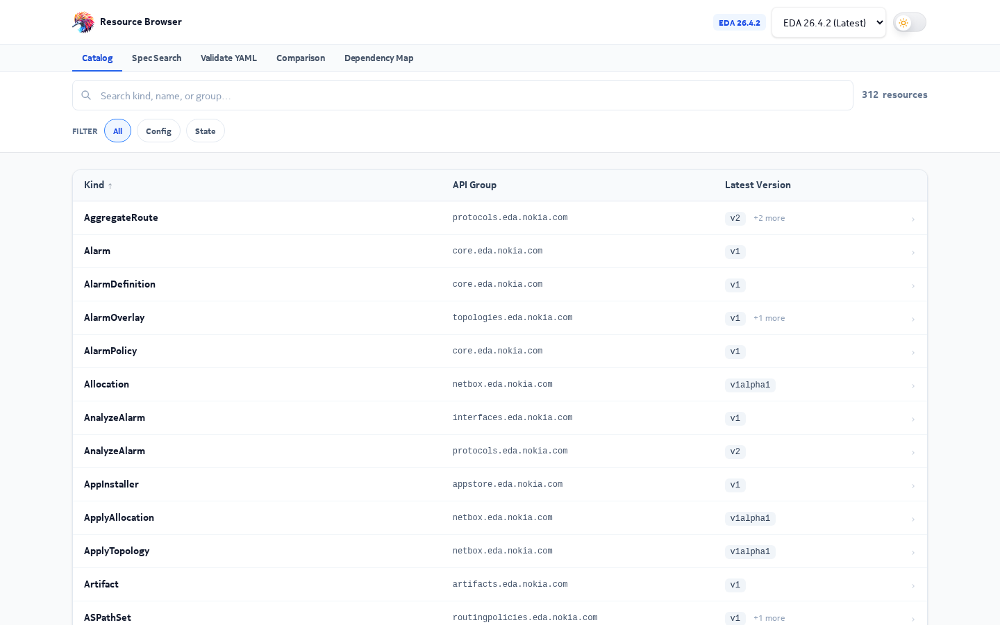
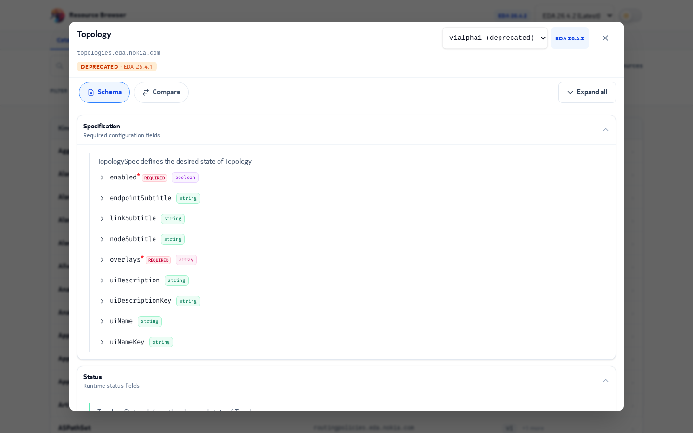
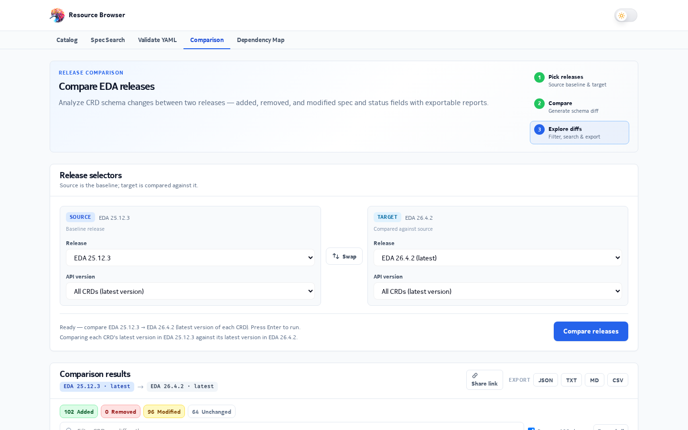
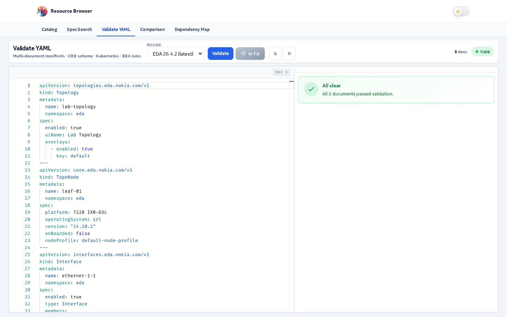
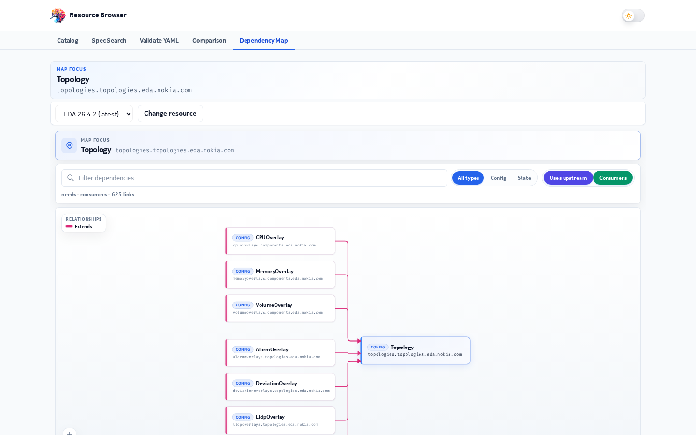
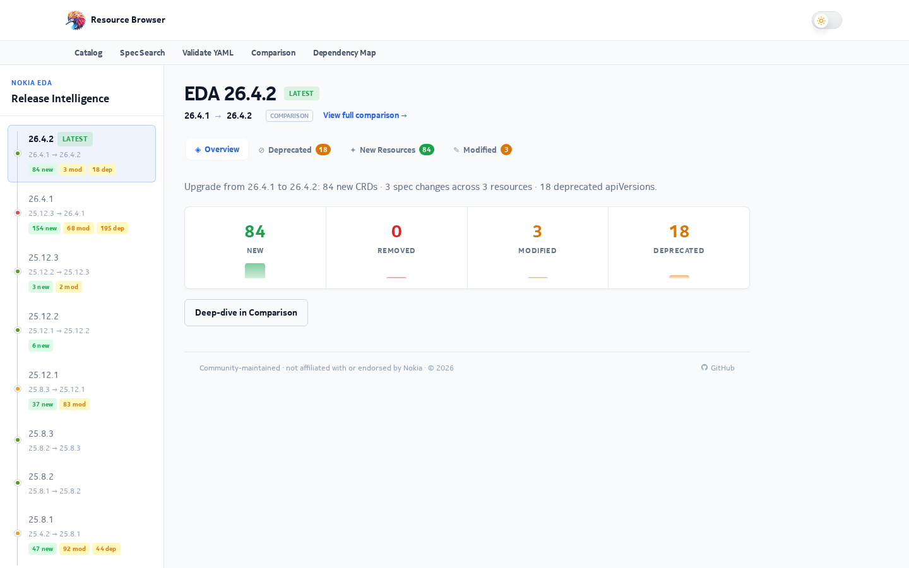
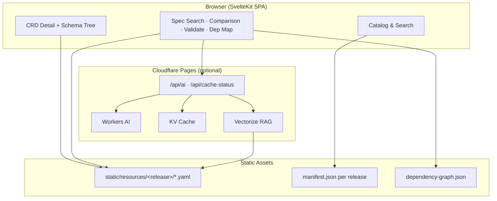

<div align="center">

[](https://eda-resource-browser.pages.dev)
[](https://github.com/fullstopdev/resource-browser)
[](https://kit.svelte.dev)
[](https://svelte.dev)
[](https://www.typescriptlang.org)
[](https://tailwindcss.com)
[](https://pages.cloudflare.com)
[](LICENSE)

# EDA Resource Browser

**A fast, release-aware web UI for exploring Nokia Event-Driven Automation (EDA) Custom Resource Definitions.**

Browse CRD catalogs across EDA releases, inspect OpenAPI schemas, validate YAML, compare versions, and visualize resource dependencies — with optional Cloudflare Workers AI assistance.

[Live Demo](https://eda-resource-browser.pages.dev) · [Report an Issue](https://github.com/fullstopdev/resource-browser/issues) · [EDA Documentation](https://docs.eda.dev/)

</div>

> [!IMPORTANT]
> **Community project.** EDA Resource Browser is community-maintained and **not affiliated with or endorsed by Nokia**. CRD manifests are bundled from public release artifacts for reference and exploration.

---

## Why EDA Resource Browser?

Working with Nokia EDA means navigating hundreds of Custom Resource Definitions across multiple release trains. Official docs are comprehensive, but day-to-day tasks — finding a field, validating a manifest, or understanding what changed between releases — need a purpose-built explorer.

**EDA Resource Browser** fills that gap:

- **Static-first architecture** — CRD YAML and manifests ship with the app under `static/resources/`, so browsing and schema inspection work without a backend.
- **Release-aware catalog** — Switch between EDA releases (25.4.x through 26.4.x) and drill into any CRD version.
- **Power tools** — Spec search, bulk release comparison, YAML validation, and an interactive dependency map.
- **Optional AI layer** — Cloudflare Workers AI, Vectorize RAG, and KV caching power schema-grounded actions and YAML fix suggestions on deploy.

---

## Screenshots

> Add screenshots to `docs/images/` and replace the placeholders below.

| Catalog & search | CRD schema detail | Release comparison |
| :---: | :---: | :---: |
|  |  |  |

| YAML validation | Dependency map | Release notes |
| :---: | :---: | :---: |
|  |  |  |

---

## Core Capabilities

### 1. Release Catalog & Resource Browser

The home page is a release-grouped catalog of every CRD in the selected EDA release.

- Full-text search across kind, group, and resource name
- Filter by resource type (state, config, or all)
- Per-resource detail pages with navigable OpenAPI-style schema trees
- Raw YAML view with copy support
- Sidebar navigation on detail pages for quick field lookup

### 2. Spec Search

Search **inside** CRD schemas across an entire release — find fields by name, path, or description without opening each resource individually.

- Regex-aware query matching
- Highlights matching schema paths
- Deep-links to the exact field on the resource page

### 3. YAML Validation

A Monaco-powered editor validates multi-document YAML bundles against live CRD schemas.

- Real-time AJV schema validation with inline error markers
- Schema-aware completions and hover documentation
- Deterministic structural fixes where possible
- **AI-assisted fix** (optional) — preview and apply LLM-suggested corrections for complex issues
- Shareable bundle URLs for collaboration

### 4. Release Comparison

Compare two EDA releases side by side and generate a bulk diff report.

- Added, removed, and modified CRDs at a glance
- Per-resource schema diffs with expandable detail panels
- Filter by change status and search within results
- Direct links to affected resources

### 5. Dependency Map

An interactive intent-topology graph built from CRD schema cross-references.

- Search and focus on any CRD
- Drill-down navigation with breadcrumb history
- Powered by `@xyflow/svelte` and D3 layout algorithms
- Precomputed `dependency-graph.json` per release for fast load

### 6. Release Notes

Auto-generated release notes highlight what changed between EDA versions — new resources, deprecations, field modifications, and operational impact summaries.

---

## AI Features (Cloudflare)

When deployed to Cloudflare Pages with Workers AI bindings, the app exposes schema-grounded AI actions via `/api/ai` and caches deterministic responses in KV.

| Action | Cached | Description |
| :--- | :---: | :--- |
| `explain` | ✅ | CRD overview and purpose |
| `field` | ✅ | Explanation for a specific field path |
| `example` | ✅ | Sample YAML (3 variants, random on cache hit) |
| `compare` | ✅ | Schema differences between two releases |
| `spec-search` | ✅ | Semantic field search within one CRD |
| `validate` | ❌ | Validate user YAML with AI commentary |
| `fix` | ❌ | Per-issue YAML fix on the Validate page |

> [!NOTE]
> The legacy free-form **Ask** tab (`/api/ask` + Vectorize RAG) is disabled by default. Set `PUBLIC_ASK_AI_ENABLED=true` to restore the legacy UI. YAML fix AI is enabled by default (`PUBLIC_FIX_AI_ENABLED`).

**Bindings** (see `wrangler.toml`):

| Binding | Service | Purpose |
| :--- | :--- | :--- |
| `AI` | Workers AI | LLM inference (`@cf/meta/llama-3.1-8b-instruct-fast`) |
| `AI_CACHE` | KV | Deterministic action response cache |
| `CRD_INDEX` | Vectorize | CRD schema chunks (optional RAG) |
| `DOCS_INDEX` | Vectorize | Crawled [docs.eda.dev](https://docs.eda.dev/) pages (optional RAG) |

---

## Tech Stack

| Layer | Technology |
| :--- | :--- |
| **Framework** | [SvelteKit 2](https://kit.svelte.dev) + [Svelte 5](https://svelte.dev) |
| **Build** | [Vite 7](https://vitejs.dev) |
| **Styling** | [Tailwind CSS 4](https://tailwindcss.com) |
| **Language** | TypeScript 5 |
| **Schema validation** | [AJV 8](https://ajv.js.org) |
| **Editor** | [Monaco Editor](https://microsoft.github.io/monaco-editor/) |
| **Graphs** | [@xyflow/svelte](https://svelteflow.dev) + [D3](https://d3js.org) |
| **Deployment** | [Cloudflare Pages](https://pages.cloudflare.com) (primary), [Vercel](https://vercel.com) (optional) |
| **AI / RAG** | Cloudflare Workers AI, Vectorize, KV |
| **Testing** | [Vitest](https://vitest.dev) + [Playwright](https://playwright.dev) |

---

## Quick Start

### Prerequisites

- **Node.js** 20+
- **npm** or **pnpm**

### 1. Clone & Install

```bash
git clone https://github.com/fullstopdev/resource-browser.git
cd resource-browser
npm install
```

### 2. Run the Dev Server

```bash
npm run dev
```

Open [http://localhost:5173](http://localhost:5173). The catalog reads CRD data from `static/resources/<release>/` — no external API required for browsing.

### 3. Build for Production

```bash
npm run prepare
npm run build
npm run preview
```

The `prebuild` hook generates the sitemap and release notes automatically.

---

## Configuration

Copy `.env.example` to `.env` and adjust as needed:

```bash
cp .env.example .env
```

| Variable | Default | Description |
| :--- | :--- | :--- |
| `ADAPTER` | `cloudflare` | Set to `vercel` for Vercel deployment |
| `PUBLIC_FIX_AI_ENABLED` | `true` | Enable AI YAML fix on `/validate-yaml` |
| `PUBLIC_ASK_AI_ENABLED` | `false` | Show legacy Ask AI UI (requires Vectorize) |
| `CLOUDFLARE_API_TOKEN` | — | Wrangler / Workers AI auth (never commit) |

Release list is configured in `src/lib/releases.yaml`. Each entry maps a release name to its folder under `static/resources/`.

---

## Deployment

### Cloudflare Pages (recommended)

```bash
npm run build:cloudflare
npm run deploy:cloudflare
```

Or connect the repository in the Cloudflare dashboard — build command: `npm run build:cloudflare`, output directory: `.svelte-kit/cloudflare`.

**Lean deploy** (static site only, no AI bindings):

```bash
npm run deploy:cloudflare:lean
```

### Vercel

```bash
ADAPTER=vercel npm run build:vercel
```

### Local AI Development

Test Workers AI actions locally with Wrangler:

```bash
export CLOUDFLARE_API_TOKEN=your_token   # or: npx wrangler login
npm run dev:ai
```

The dev server runs at [http://localhost:8788](http://localhost:8788) with remote AI, KV, and Vectorize bindings.

```bash
curl -s -X POST http://localhost:8788/api/ai \
  -H 'Content-Type: application/json' \
  -d '{"release":"26.4.2","kind":"Fabric","group":"fabrics.eda.nokia.com","action":"explain"}'
```

---

## Vectorize RAG Setup (Optional)

Vectorize indexes power semantic retrieval for the legacy Ask feature and enrich AI context. **The app works without Vectorize** — bindings are optional until indexes exist.

### Create Indexes

```bash
wrangler vectorize create eda-crd-corpus-v1 --dimensions=768 --metric=cosine \
  --metadata-index=release --metadata-index=kind --metadata-index=group --metadata-index=chunkType

wrangler vectorize create eda-docs-v1 --dimensions=768 --metric=cosine \
  --metadata-index=source --metadata-index=release --metadata-index=section
```

Uncomment the `[[vectorize]]` blocks in `wrangler.toml`, then embed:

```bash
export CLOUDFLARE_API_TOKEN=your_token
npm run embed:crd-corpus          # CRD schema chunks from static/resources/
npm run embed:eda-docs            # Crawled docs.eda.dev pages
```

Useful flags:

```bash
npm run embed:crd-corpus -- --release 26.4.2   # Single release
npm run embed:crd-corpus -- --dry-run          # Count chunks only
npm run embed:rebuild-manifest                 # Sync local manifest with Vectorize
```

> [!NOTE]
> **Workers AI neuron budget:** Embedding and LLM calls share Cloudflare's daily neuron quota (10,000/day on Free/Paid Workers plans). Large embed jobs may hit HTTP 429 — resume after quota reset. Embed scripts track progress in `.vectorize-manifest.json` (gitignored) and skip already-upserted chunks on re-run.

---

## KV Cache & Warm-Up

Deterministic AI actions are cached in KV so each `(release × kind × action)` burns neurons only once.

### One-Time KV Setup

```bash
wrangler kv namespace create AI_CACHE
wrangler kv namespace create AI_CACHE --preview
# Copy id + preview_id into wrangler.toml [[kv_namespaces]]
```

### Warm Cache After Deploy

```bash
export NODE_EXTRA_CA_CERTS=/etc/ssl/certs/ca-certificates.crt   # if needed
SITE_URL=https://eda-resource-browser.pages.dev RELEASE=26.4.2 npm run warm:cache
```

Check coverage:

```bash
curl "https://eda-resource-browser.pages.dev/api/cache-status?release=26.4.2&summary=true"
```

---

## Project Structure

```
resource-browser/
├── src/
│   ├── routes/                  # SvelteKit pages & API endpoints
│   │   ├── +page.svelte         # Home catalog
│   │   ├── [name]/[version]/    # CRD detail pages
│   │   ├── comparison/          # Release diff tool
│   │   ├── dependency-map/      # Interactive topology graph
│   │   ├── validate-yaml/       # YAML validator + AI fix
│   │   ├── spec-search/         # Schema field search
│   │   ├── release-notes/       # Auto-generated changelogs
│   │   └── api/ai/              # Workers AI action endpoint
│   └── lib/
│       ├── ai/                  # Prompts, KV cache, AI client
│       ├── comparison/          # Diff engine & UI components
│       ├── dependency-map/      # Graph builder & layout
│       ├── validate-bundle/     # Monaco editor, AJV validation
│       ├── manifest/            # CRD manifest loaders
│       └── releases.yaml        # Release configuration
├── static/
│   └── resources/<release>/       # Bundled CRD YAML + manifest.json
├── scripts/                     # Embed, warm-cache, sitemap generators
├── wrangler.toml                # Cloudflare bindings
└── svelte.config.js             # Adapter selection (Cloudflare / Vercel)
```

### Adding a New EDA Release

1. Place CRD YAML files under `static/resources/<release>/`
2. Generate `manifest.json` for the release (see `static/get-crds-for-release.sh`)
3. Add the release entry to `src/lib/releases.yaml`
4. Optionally run `npm run build:dependency-graph` for the dependency map
5. Rebuild — `prebuild` regenerates sitemap and release notes

---

## Architecture Overview



**Data flow:**

1. **Browse** — Client loads `manifest.json` and YAML from static assets; no server round-trip for catalog operations.
2. **Validate** — AJV compiles OpenAPI schemas client-side; Monaco provides editor UX.
3. **Compare** — Diff engine loads schemas from two releases and computes structural changes.
4. **AI actions** — POST to `/api/ai` with release/kind/action; KV serves cache hits at zero neuron cost.

---

## Development

### Scripts

| Command | Description |
| :--- | :--- |
| `npm run dev` | Vite dev server with hot reload |
| `npm run dev:ai` | Build + Wrangler Pages dev with AI bindings |
| `npm run build` | Production build (default Cloudflare adapter) |
| `npm run build:cloudflare` | Cloudflare Pages build |
| `npm run build:vercel` | Vercel build |
| `npm run check` | TypeScript / Svelte type checking |
| `npm run lint` | Prettier + ESLint |
| `npm run test` | Vitest unit tests + Playwright e2e |
| `npm run format` | Auto-format with Prettier |

### Testing

```bash
npm run test:unit        # Vitest (client + server projects)
npm run test:e2e         # Playwright end-to-end
npm run test             # Both
```

---

## Corporate Network Notes

If direct HTTPS to `api.cloudflare.com` fails behind a corporate proxy:

- Keep `HTTP_PROXY` / `HTTPS_PROXY` set when running Wrangler and embed scripts
- Set `NODE_EXTRA_CA_CERTS` for warm-cache and HTTPS requests
- Embed scripts use undici `ProxyAgent` automatically when proxy env vars are present

---

## Contributing

Contributions are welcome! To get started:

1. Fork the repository
2. Create a feature branch (`git checkout -b feature/my-improvement`)
3. Make your changes with tests where appropriate
4. Run `npm run check && npm run lint && npm run test`
5. Open a pull request with a clear description and screenshots for UI changes

Please keep PRs focused and UI-polished. For new EDA releases, include the manifest and a note in the PR description.

---

## License

EDA Resource Browser is distributed under the **[Apache License 2.0](LICENSE)**.

You are free to use, modify, and distribute this software in compliance with the license terms.

---

<div align="center">

**Built for the Nokia EDA community.**

[⭐ Star on GitHub](https://github.com/fullstopdev/resource-browser) · [🌐 Live Demo](https://eda-resource-browser.pages.dev) · [📖 EDA Docs](https://docs.eda.dev/)

</div>
